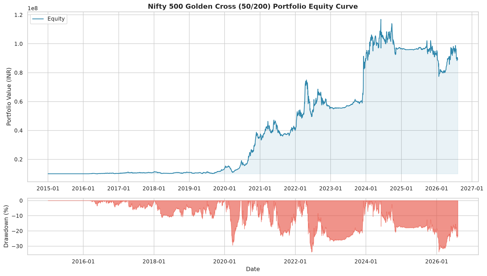
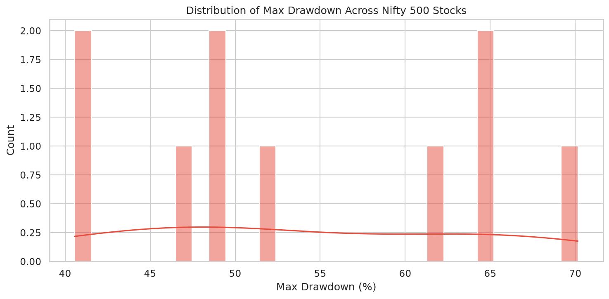
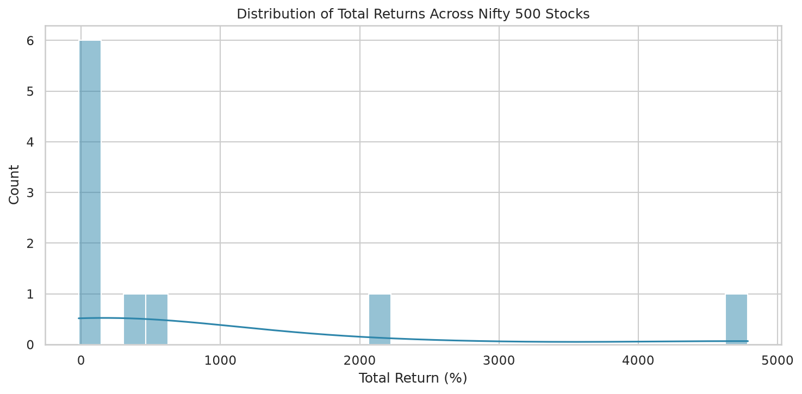

# Golden Cross / Death Cross Backtest Report

**Generated:** 2026-08-09 07:20:45

## Strategy

- **Golden Cross (BUY):** 50-day SMA crosses **above** 200-day SMA
- **Death Cross (SELL):** 50-day SMA crosses **below** 200-day SMA
- **Universe:** Nifty 500 (10 stocks with sufficient data)
- **Initial Capital:** ₹10,000,000
- **Allocation:** Equal weight per stock (₹1,000,000 each)

## Portfolio Performance Summary

| Metric                 |   Value |
|:-----------------------|--------:|
| Total Return (%)       |  792.83 |
| CAGR (%)               |   20.78 |
| Max Drawdown (%)       |   33.92 |
| Max DD Duration (days) |  544    |
| Sharpe Ratio           |    0.65 |
| Sortino Ratio          |    0.79 |
| Calmar Ratio           |    0.61 |
| Annual Volatility (%)  |   23.12 |
| Win Rate (%)           |   42.42 |
| Number of Trades       |   66    |
| Avg Trade Return (%)   |   60.93 |
| Avg Win (%)            |  163.46 |
| Avg Loss (%)           |  -14.63 |
| Profit Factor          |    8.24 |
| Expectancy (%)         |   60.93 |
| Best Trade (%)         | 2185.02 |
| Worst Trade (%)        |  -35.84 |
| Avg Holding (days)     |  296.2  |
| Exposure (%)           |    0    |
| Recovery Factor        |   23.37 |
| Ulcer Index            |   13.52 |

## Cross-Stock Statistics

- **Stocks with positive return:** 9 / 10
- **Median Total Return:** 76.97%
- **Median Max Drawdown:** 50.62%
- **Median Win Rate:** 46.43%
- **Median Sharpe:** 0.06

## Top 10 Performers

| Symbol     |   Total Return % |   CAGR % |   Max Drawdown % |   Sharpe |   Win Rate % |   Trades |   Profit Factor |
|:-----------|-----------------:|---------:|-----------------:|---------:|-------------:|---------:|----------------:|
| ADANIGREEN |          4787.16 |    61.28 |            49.30 |     1.24 |        75.00 |        4 |           78.71 |
| ADANIPOWER |          2093.65 |    30.51 |            64.70 |     0.69 |        66.67 |        6 |           13.15 |
| ABB        |           526.61 |    17.14 |            40.57 |     0.50 |        42.86 |        7 |           13.58 |
| APLAPOLLO  |           333.46 |    13.48 |            49.32 |     0.35 |        42.86 |        7 |            9.02 |
| AIAENG     |            79.33 |     5.17 |            51.92 |     0.04 |        50.00 |        6 |            2.40 |
| ADANIPORTS |            74.62 |     4.92 |            65.07 |     0.07 |        33.33 |        9 |            2.03 |
| AAVAS      |            37.84 |     4.18 |            40.62 |    -0.04 |        50.00 |        4 |            2.95 |
| ACC        |             6.88 |     0.58 |            47.32 |    -0.23 |        22.22 |        9 |            1.44 |
| 3MINDIA    |             6.54 |     0.55 |            62.17 |    -0.19 |        50.00 |        8 |            1.47 |
| AUBANK     |           -17.76 |    -2.13 |            70.15 |    -0.17 |        16.67 |        6 |            0.54 |

## Bottom 10 Performers

| Symbol     |   Total Return % |   CAGR % |   Max Drawdown % |   Sharpe |   Win Rate % |   Trades |   Profit Factor |
|:-----------|-----------------:|---------:|-----------------:|---------:|-------------:|---------:|----------------:|
| ADANIGREEN |          4787.16 |    61.28 |            49.30 |     1.24 |        75.00 |        4 |           78.71 |
| ADANIPOWER |          2093.65 |    30.51 |            64.70 |     0.69 |        66.67 |        6 |           13.15 |
| ABB        |           526.61 |    17.14 |            40.57 |     0.50 |        42.86 |        7 |           13.58 |
| APLAPOLLO  |           333.46 |    13.48 |            49.32 |     0.35 |        42.86 |        7 |            9.02 |
| AIAENG     |            79.33 |     5.17 |            51.92 |     0.04 |        50.00 |        6 |            2.40 |
| ADANIPORTS |            74.62 |     4.92 |            65.07 |     0.07 |        33.33 |        9 |            2.03 |
| AAVAS      |            37.84 |     4.18 |            40.62 |    -0.04 |        50.00 |        4 |            2.95 |
| ACC        |             6.88 |     0.58 |            47.32 |    -0.23 |        22.22 |        9 |            1.44 |
| 3MINDIA    |             6.54 |     0.55 |            62.17 |    -0.19 |        50.00 |        8 |            1.47 |
| AUBANK     |           -17.76 |    -2.13 |            70.15 |    -0.17 |        16.67 |        6 |            0.54 |

## Charts

## Files Generated

- `equity_curve_20260809_072044.png` — Portfolio equity curve + drawdown
- `stock_summary_20260809_072044.csv` — Per-stock metrics CSV
- `drawdown_distribution_20260809_072044.png` — Drawdown distribution
- `return_distribution_20260809_072044.png` — Return distribution