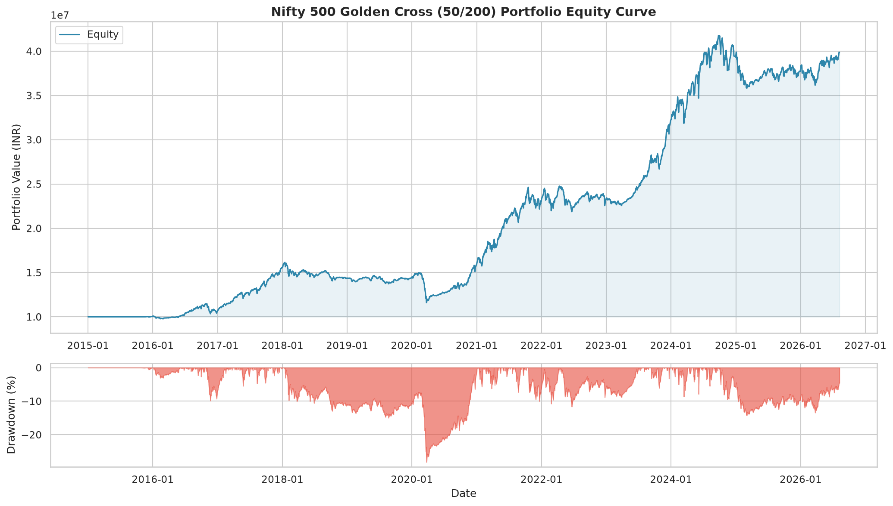
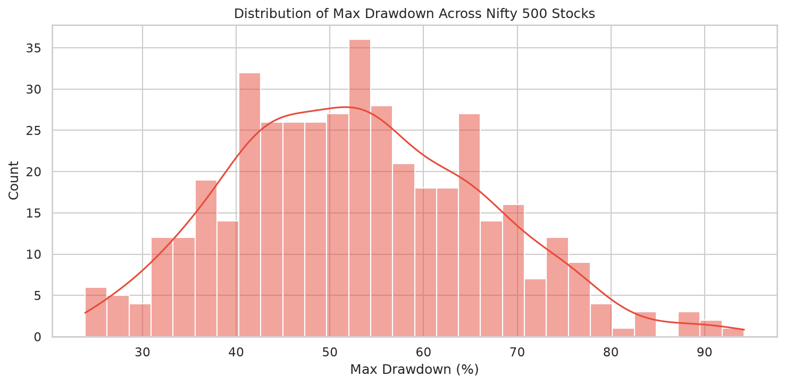
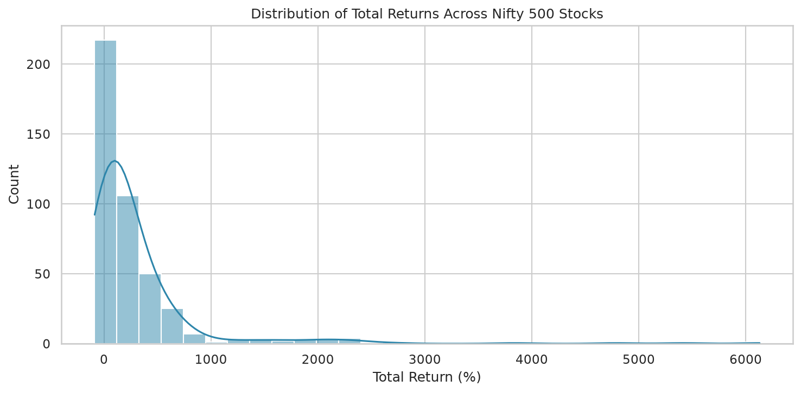

# Golden Cross / Death Cross Backtest Report

**Generated:** 2026-08-09 07:21:47

## Strategy

- **Golden Cross (BUY):** 50-day SMA crosses **above** 200-day SMA
- **Death Cross (SELL):** 50-day SMA crosses **below** 200-day SMA
- **Universe:** Nifty 500 (429 stocks with sufficient data)
- **Initial Capital:** ₹10,000,000
- **Allocation:** Equal weight per stock (₹23,310 each)

## Portfolio Performance Summary

| Metric                 |   Value |
|:-----------------------|--------:|
| Total Return (%)       |  298.49 |
| CAGR (%)               |   12.66 |
| Max Drawdown (%)       |   28.19 |
| Max DD Duration (days) |  730    |
| Sharpe Ratio           |    0.52 |
| Sortino Ratio          |    0.52 |
| Calmar Ratio           |    0.45 |
| Annual Volatility (%)  |   11.24 |
| Win Rate (%)           |   43.81 |
| Number of Trades       | 2915    |
| Avg Trade Return (%)   |   29.08 |
| Avg Win (%)            |   84.5  |
| Avg Loss (%)           |  -14.13 |
| Profit Factor          |    4.66 |
| Expectancy (%)         |   29.08 |
| Best Trade (%)         | 3949.48 |
| Worst Trade (%)        |  -82.44 |
| Avg Holding (days)     |  297.9  |
| Exposure (%)           |    0    |
| Recovery Factor        |   10.59 |
| Ulcer Index            |    8.09 |

## Cross-Stock Statistics

- **Stocks with positive return:** 357 / 429
- **Median Total Return:** 116.14%
- **Median Max Drawdown:** 52.52%
- **Median Win Rate:** 42.86%
- **Median Sharpe:** 0.14

## Top 10 Performers

| Symbol     |   Total Return % |   CAGR % |   Max Drawdown % |   Sharpe |   Win Rate % |   Trades |   Profit Factor |
|:-----------|-----------------:|---------:|-----------------:|---------:|-------------:|---------:|----------------:|
| HEG        |          6130.06 |    42.80 |            57.98 |     0.91 |        75.00 |        4 |          626.86 |
| BSE        |          5418.27 |    52.49 |            45.18 |     1.14 |        50.00 |        2 |           13.24 |
| ADANIGREEN |          4787.16 |    61.28 |            49.30 |     1.24 |        75.00 |        4 |           78.71 |
| JSL        |          3836.77 |    37.26 |            56.80 |     0.86 |        80.00 |        5 |           32.49 |
| HSCL       |          2714.62 |    33.34 |            66.89 |     0.82 |        50.00 |       10 |           17.98 |
| CGPOWER    |          2395.92 |    31.97 |            51.90 |     0.84 |        16.67 |        6 |           68.76 |
| GRAPHITE   |          2394.71 |    31.96 |            35.86 |     0.80 |        60.00 |        5 |           40.55 |
| GNFC       |          2315.49 |    31.60 |            40.24 |     0.79 |       100.00 |        3 |          999.99 |
| KEI        |          2244.32 |    31.26 |            65.22 |     0.76 |        40.00 |        5 |           23.25 |
| KIRLOSENG  |          2147.01 |    30.78 |            32.14 |     0.85 |        60.00 |        5 |           31.17 |

## Bottom 10 Performers

| Symbol     |   Total Return % |   CAGR % |   Max Drawdown % |   Sharpe |   Win Rate % |   Trades |   Profit Factor |
|:-----------|-----------------:|---------:|-----------------:|---------:|-------------:|---------:|----------------:|
| KRBL       |           -60.57 |    -7.71 |            68.04 |    -0.44 |        20.00 |       10 |            0.31 |
| IBREALEST  |           -61.59 |    -7.92 |            82.97 |    -0.20 |        33.33 |        9 |            0.93 |
| RCOM       |           -62.19 |    -8.04 |            74.77 |    -0.40 |        16.67 |        6 |            0.64 |
| SYMPHONY   |           -63.33 |    -8.29 |            80.39 |    -0.51 |        20.00 |       10 |            0.36 |
| DISHTV     |           -65.57 |    -8.78 |            70.16 |    -0.42 |        16.67 |        6 |            0.02 |
| GREAVESCOT |           -67.08 |    -9.14 |            75.29 |    -0.39 |        23.08 |       13 |            0.49 |
| ZEEL       |           -67.45 |    -9.22 |            77.82 |    -0.55 |        37.50 |        8 |            0.12 |
| OMAXE      |           -73.26 |   -10.75 |            79.54 |    -0.54 |        14.29 |        7 |            0.13 |
| IDBI       |           -77.77 |   -12.16 |            89.61 |    -0.44 |        20.00 |       10 |            0.59 |
| SHANKARA   |           -86.96 |   -19.60 |            89.11 |    -0.44 |        25.00 |        8 |            0.52 |

## Charts

## Files Generated

- `equity_curve_20260809_072146.png` — Portfolio equity curve + drawdown
- `stock_summary_20260809_072146.csv` — Per-stock metrics CSV
- `drawdown_distribution_20260809_072146.png` — Drawdown distribution
- `return_distribution_20260809_072146.png` — Return distribution