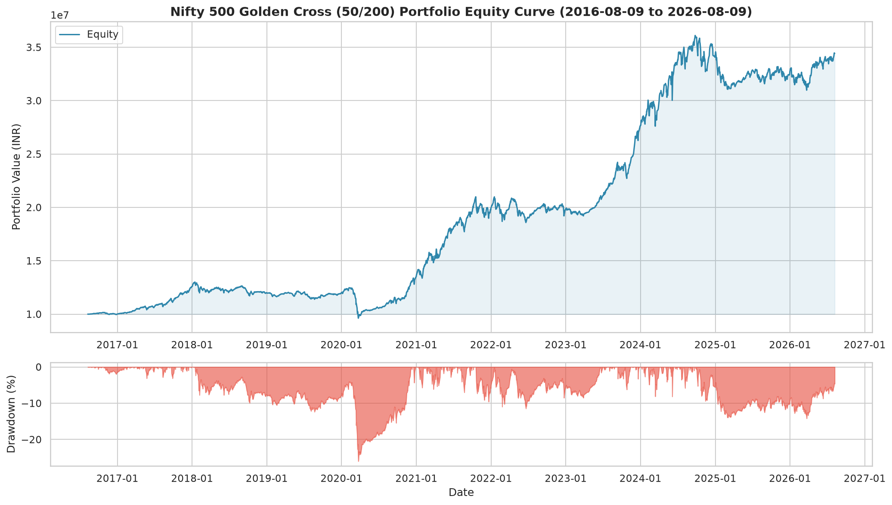
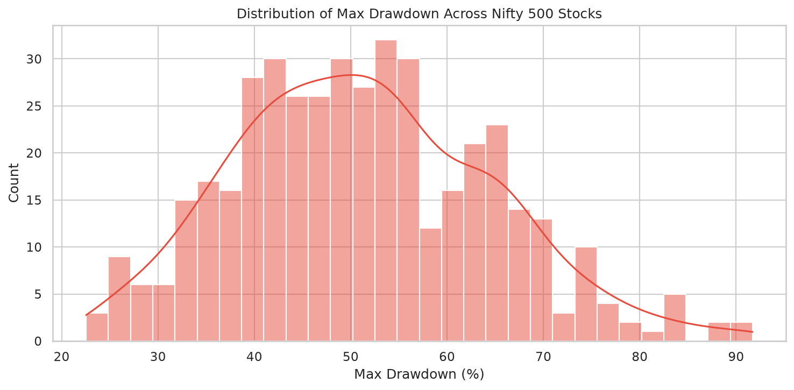
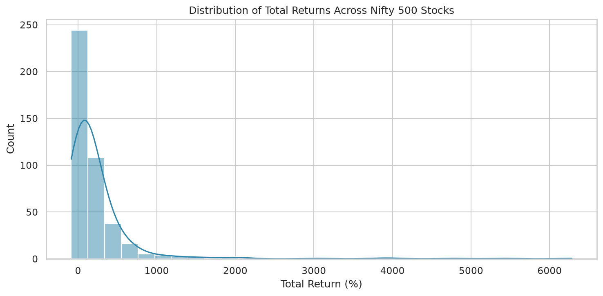

# Golden Cross / Death Cross Backtest Report

**Generated:** 2026-08-09 07:24:19

## Strategy

- **Golden Cross (BUY):** 50-day SMA crosses **above** 200-day SMA
- **Death Cross (SELL):** 50-day SMA crosses **below** 200-day SMA
- **Universe:** Nifty 500 (429 stocks with sufficient data)
- **Backtest Period:** 2016-08-09 to 2026-08-09
- **Initial Capital:** ₹10,000,000
- **Allocation:** Equal weight per stock (₹23,310 each)

## Portfolio Performance Summary

| Metric                 |   Value |
|:-----------------------|--------:|
| Total Return (%)       |  244.24 |
| CAGR (%)               |   13.17 |
| Max Drawdown (%)       |   25.99 |
| Max DD Duration (days) |  711    |
| Sharpe Ratio           |    0.55 |
| Sortino Ratio          |    0.57 |
| Calmar Ratio           |    0.51 |
| Annual Volatility (%)  |   11.5  |
| Win Rate (%)           |   42.89 |
| Number of Trades       | 2602    |
| Avg Trade Return (%)   |   28.23 |
| Avg Win (%)            |   84.89 |
| Avg Loss (%)           |  -14.31 |
| Profit Factor          |    4.45 |
| Expectancy (%)         |   28.23 |
| Best Trade (%)         | 3949.48 |
| Worst Trade (%)        |  -82.44 |
| Avg Holding (days)     |  291.5  |
| Exposure (%)           |    0    |
| Recovery Factor        |    9.4  |
| Ulcer Index            |    7.58 |

## Cross-Stock Statistics

- **Stocks with positive return:** 347 / 429
- **Median Total Return:** 92.20%
- **Median Max Drawdown:** 50.32%
- **Median Win Rate:** 42.86%
- **Median Sharpe:** 0.13

## Top 10 Performers

| Symbol     |   Total Return % |   CAGR % |   Max Drawdown % |   Sharpe |   Win Rate % |   Trades |   Profit Factor |
|:-----------|-----------------:|---------:|-----------------:|---------:|-------------:|---------:|----------------:|
| HEG        |          6282.35 |    51.57 |            57.98 |     1.02 |       100.00 |        3 |          999.99 |
| BSE        |          5418.27 |    52.49 |            45.18 |     1.14 |        50.00 |        2 |           13.24 |
| ADANIGREEN |          4787.16 |    61.28 |            49.30 |     1.24 |        75.00 |        4 |           78.71 |
| CGPOWER    |          4005.66 |    45.03 |            37.25 |     1.15 |        33.33 |        3 |          289.44 |
| JSL        |          3836.77 |    44.42 |            56.80 |     0.95 |        80.00 |        5 |           32.49 |
| GRAPHITE   |          3052.22 |    41.24 |            35.86 |     0.97 |       100.00 |        3 |          999.99 |
| LAURUSLABS |          2047.71 |    37.50 |            55.56 |     1.03 |        33.33 |        3 |           16.27 |
| ADANIPOWER |          2033.42 |    35.83 |            64.14 |     0.76 |        60.00 |        5 |           13.10 |
| RADICO     |          1973.94 |    35.45 |            46.17 |     0.82 |        60.00 |        5 |           21.57 |
| RKFORGE    |          1689.20 |    33.46 |            37.38 |     0.90 |       100.00 |        3 |          999.99 |

## Bottom 10 Performers

| Symbol     |   Total Return % |   CAGR % |   Max Drawdown % |   Sharpe |   Win Rate % |   Trades |   Profit Factor |
|:-----------|-----------------:|---------:|-----------------:|---------:|-------------:|---------:|----------------:|
| KRBL       |           -60.57 |    -8.89 |            68.04 |    -0.44 |        20.00 |       10 |            0.31 |
| SYMPHONY   |           -64.38 |    -9.82 |            80.39 |    -0.56 |        11.11 |        9 |            0.34 |
| IDBI       |           -64.98 |    -9.97 |            83.20 |    -0.34 |        22.22 |        9 |            0.72 |
| JMFINANCIL |           -66.21 |   -10.29 |            67.53 |    -0.47 |        25.00 |        8 |            0.14 |
| EDELWEISS  |           -67.68 |   -10.69 |            77.72 |    -0.42 |        12.50 |        8 |            0.22 |
| ZEEL       |           -68.31 |   -10.86 |            77.82 |    -0.60 |        28.57 |        7 |            0.09 |
| OMAXE      |           -73.26 |   -12.36 |            79.54 |    -0.55 |        14.29 |        7 |            0.13 |
| MOTILALOFS |           -82.07 |   -15.80 |            82.75 |    -0.40 |        20.00 |       10 |            0.22 |
| VAKRANGEE  |           -85.98 |   -17.85 |            91.54 |    -0.76 |        16.67 |        6 |            0.09 |
| SHANKARA   |           -86.96 |   -19.60 |            89.11 |    -0.44 |        25.00 |        8 |            0.52 |

## Charts

## Files Generated

- `equity_curve_20260809_072418.png` — Portfolio equity curve + drawdown
- `stock_summary_20260809_072418.csv` — Per-stock metrics CSV
- `drawdown_distribution_20260809_072418.png` — Drawdown distribution
- `return_distribution_20260809_072418.png` — Return distribution