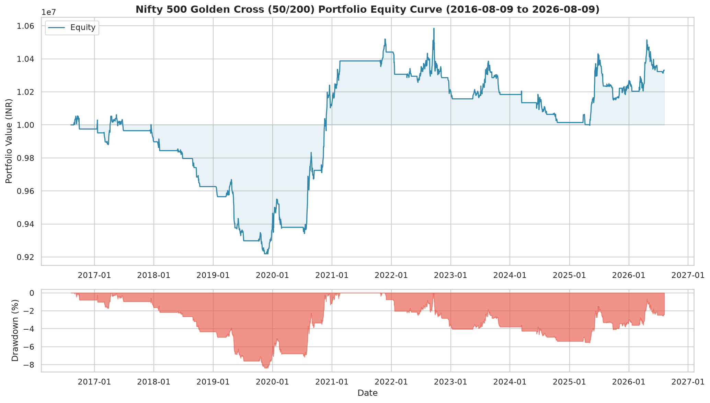
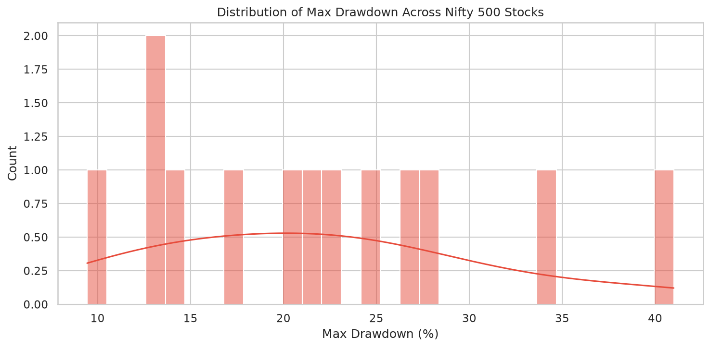
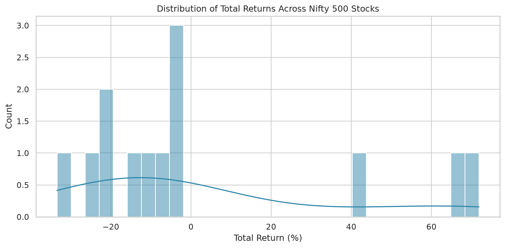

# Golden Cross / Death Cross Backtest Report

**Generated:** 2026-08-09 07:39:33

## Strategy

- **Golden Cross (BUY):** 50-day SMA crosses **above** 200-day SMA
- **Death Cross (SELL):** 50-day SMA crosses **below** 200-day SMA

### Risk rules (limit losses)

- **Stop loss:** sell if price falls **8%** below entry
- **Trailing stop:** sell if price falls **10%** from highest since entry (enabled)
- **Take profit:** sell at **+40%** above entry (if hit before other exits)
- **Death cross** still exits if none of the above trigger first

- **Universe:** Nifty 500 (13 stocks with sufficient data)
- **Backtest Period:** 2016-08-09 to 2026-08-09
- **Initial Capital:** ₹10,000,000
- **Allocation:** Equal weight per stock (₹769,231 each)

## Portfolio Performance Summary

| Metric                 |   Value |
|:-----------------------|--------:|
| Total Return (%)       |    3.32 |
| CAGR (%)               |    0.33 |
| Max Drawdown (%)       |    8.38 |
| Max DD Duration (days) |  961    |
| Sharpe Ratio           |   -3.04 |
| Sortino Ratio          |   -2.79 |
| Calmar Ratio           |    0.04 |
| Annual Volatility (%)  |    2.18 |
| Win Rate (%)           |   29.33 |
| Number of Trades       |   75    |
| Avg Trade Return (%)   |    0.38 |
| Avg Win (%)            |   14.79 |
| Avg Loss (%)           |   -5.6  |
| Profit Factor          |    1.1  |
| Expectancy (%)         |    0.38 |
| Best Trade (%)         |   39.74 |
| Worst Trade (%)        |   -8.26 |
| Avg Holding (days)     |   30.9  |
| Exposure (%)           |    0    |
| Recovery Factor        |    0.4  |
| Ulcer Index            |    3.78 |

## Cross-Stock Statistics

- **Stocks with positive return:** 3 / 13
- **Median Total Return:** -7.88%
- **Median Max Drawdown:** 21.29%
- **Median Win Rate:** 28.57%
- **Median Sharpe:** -1.22

## Exit reasons (how trades closed)

| exit_reason   |   count |   avg_return_pct |   avg_loss_pct |
|:--------------|--------:|-----------------:|---------------:|
| stop_loss     |      10 |            -8.00 |          -8.00 |
| take_profit   |       3 |            40.00 |           0.00 |
| trailing_stop |      62 |             0.13 |          -4.72 |

## Top 10 Performers

| Symbol     |   Total Return % |   CAGR % |   Max Drawdown % |   Sharpe |   Win Rate % |   Trades |   Profit Factor |
|:-----------|-----------------:|---------:|-----------------:|---------:|-------------:|---------:|----------------:|
| ABB        |            71.86 |     5.57 |            14.05 |    -0.14 |        50.00 |        6 |            5.95 |
| APLAPOLLO  |            65.91 |     5.20 |            12.82 |    -0.20 |        50.00 |        6 |            4.21 |
| ABCAPITAL  |            40.70 |     3.90 |            12.91 |    -0.33 |        60.00 |        5 |            4.16 |
| ADVENZYMES |            -1.86 |    -0.19 |            20.47 |    -0.97 |        33.33 |        6 |            1.05 |
| ADANIPOWER |            -2.03 |    -0.21 |            21.29 |    -1.22 |        40.00 |        5 |            0.94 |
| ADANIGREEN |            -2.47 |    -0.31 |            17.68 |    -1.27 |        33.33 |        3 |            0.78 |
| AIAENG     |            -7.88 |    -0.82 |            24.92 |    -0.86 |        16.67 |        6 |            0.65 |
| AAVAS      |            -9.44 |    -1.26 |             9.44 |    -2.59 |         0.00 |        2 |          nan    |
| AUBANK     |           -13.83 |    -1.63 |            27.93 |    -1.11 |        28.57 |        7 |            0.56 |
| ABFRL      |           -20.52 |    -2.27 |            22.07 |    -1.43 |        20.00 |        5 |            0.07 |

## Bottom 10 Performers

| Symbol     |   Total Return % |   CAGR % |   Max Drawdown % |   Sharpe |   Win Rate % |   Trades |   Profit Factor |
|:-----------|-----------------:|---------:|-----------------:|---------:|-------------:|---------:|----------------:|
| ADVENZYMES |            -1.86 |    -0.19 |            20.47 |    -0.97 |        33.33 |        6 |            1.05 |
| ADANIPOWER |            -2.03 |    -0.21 |            21.29 |    -1.22 |        40.00 |        5 |            0.94 |
| ADANIGREEN |            -2.47 |    -0.31 |            17.68 |    -1.27 |        33.33 |        3 |            0.78 |
| AIAENG     |            -7.88 |    -0.82 |            24.92 |    -0.86 |        16.67 |        6 |            0.65 |
| AAVAS      |            -9.44 |    -1.26 |             9.44 |    -2.59 |         0.00 |        2 |          nan    |
| AUBANK     |           -13.83 |    -1.63 |            27.93 |    -1.11 |        28.57 |        7 |            0.56 |
| ABFRL      |           -20.52 |    -2.27 |            22.07 |    -1.43 |        20.00 |        5 |            0.07 |
| 3MINDIA    |           -20.93 |    -2.32 |            34.27 |    -1.23 |        12.50 |        8 |            0.24 |
| ACC        |           -22.99 |    -2.58 |            26.78 |    -1.38 |        16.67 |        6 |            0.26 |
| ADANIPORTS |           -33.42 |    -3.99 |            41.00 |    -1.40 |        20.00 |       10 |            0.22 |

## Charts

## Files Generated

- `equity_curve_20260809_073933.png` — Portfolio equity curve + drawdown
- `stock_summary_20260809_073933.csv` — Per-stock metrics CSV
- `drawdown_distribution_20260809_073933.png` — Drawdown distribution
- `return_distribution_20260809_073933.png` — Return distribution