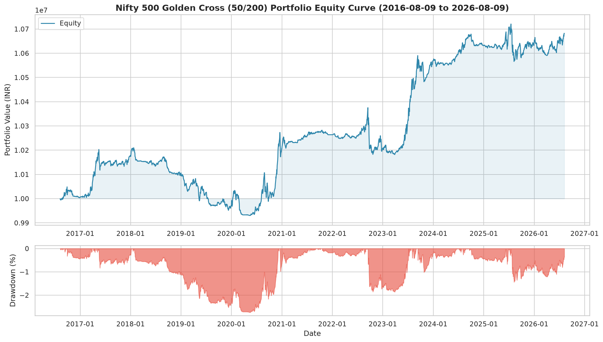
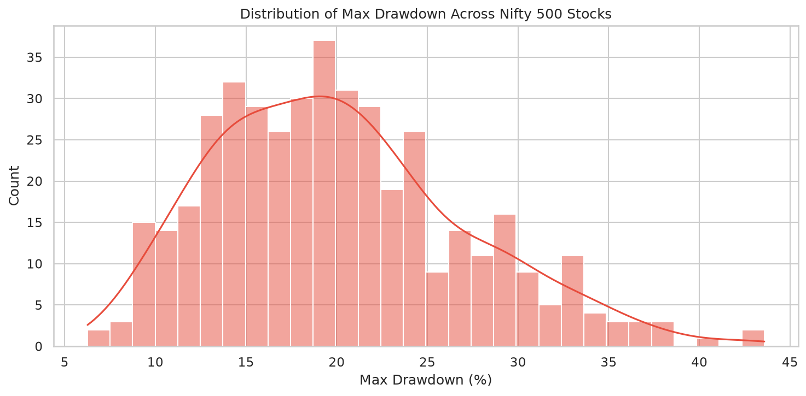
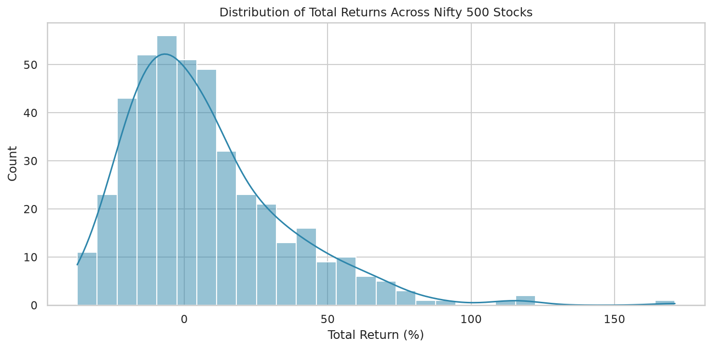

# Golden Cross / Death Cross Backtest Report

**Generated:** 2026-08-09 07:40:54

## Strategy

- **Golden Cross (BUY):** 50-day SMA crosses **above** 200-day SMA
- **Death Cross (SELL):** 50-day SMA crosses **below** 200-day SMA

### Risk rules (limit losses)

- **Stop loss:** sell if price falls **8%** below entry
- **Trailing stop:** sell if price falls **10%** from highest since entry (enabled)
- **Take profit:** sell at **+40%** above entry (if hit before other exits)
- **Death cross** still exits if none of the above trigger first

- **Universe:** Nifty 500 (429 stocks with sufficient data)
- **Backtest Period:** 2016-08-09 to 2026-08-09
- **Initial Capital:** ₹10,000,000
- **Allocation:** Equal weight per stock (₹23,310 each)

## Portfolio Performance Summary

| Metric                 |   Value |
|:-----------------------|--------:|
| Total Return (%)       |    6.82 |
| CAGR (%)               |    0.66 |
| Max Drawdown (%)       |    2.74 |
| Max DD Duration (days) |  705    |
| Sharpe Ratio           |   -5.88 |
| Sortino Ratio          |   -5.88 |
| Calmar Ratio           |    0.24 |
| Annual Volatility (%)  |    1.08 |
| Win Rate (%)           |   38.45 |
| Number of Trades       | 2458    |
| Avg Trade Return (%)   |    1.07 |
| Avg Win (%)            |   11.54 |
| Avg Loss (%)           |   -5.46 |
| Profit Factor          |    1.32 |
| Expectancy (%)         |    1.07 |
| Best Trade (%)         |   39.74 |
| Worst Trade (%)        |   -8.26 |
| Avg Holding (days)     |   38    |
| Exposure (%)           |    0    |
| Recovery Factor        |    2.49 |
| Ulcer Index            |    1.11 |

## Cross-Stock Statistics

- **Stocks with positive return:** 215 / 429
- **Median Total Return:** 0.22%
- **Median Max Drawdown:** 19.44%
- **Median Win Rate:** 37.50%
- **Median Sharpe:** -0.94

## Exit reasons (how trades closed)

| exit_reason   |   count |   avg_return_pct |   avg_loss_pct |
|:--------------|--------:|-----------------:|---------------:|
| death_cross   |      38 |            -2.56 |          -2.97 |
| stop_loss     |     292 |            -8.00 |          -8.00 |
| take_profit   |      93 |            40.00 |           0.00 |
| trailing_stop |    2035 |             0.98 |          -4.66 |

## Top 10 Performers

| Symbol     |   Total Return % |   CAGR % |   Max Drawdown % |   Sharpe |   Win Rate % |   Trades |   Profit Factor |
|:-----------|-----------------:|---------:|-----------------:|---------:|-------------:|---------:|----------------:|
| JINDALSTEL |           171.05 |    10.49 |            14.85 |     0.33 |       100.00 |        7 |          999.99 |
| SIEMENS    |           118.81 |     8.15 |            12.53 |     0.15 |        80.00 |        5 |           30.32 |
| MRF        |           116.12 |     8.02 |            11.26 |     0.13 |        83.33 |        6 |           19.95 |
| NATCOPHARM |           110.61 |     7.74 |            14.71 |     0.11 |        71.43 |        7 |            9.46 |
| GRASIM     |            91.63 |     6.72 |            16.16 |     0.02 |        50.00 |        6 |            5.59 |
| KARURVYSYA |            85.12 |     6.36 |             8.62 |    -0.05 |       100.00 |        3 |          999.99 |
| COROMANDEL |            79.99 |     6.06 |            12.43 |    -0.06 |        71.43 |        7 |            7.63 |
| CGPOWER    |            78.99 |     6.00 |             9.76 |    -0.09 |       100.00 |        3 |          999.99 |
| MAHSCOOTER |            74.02 |     5.70 |            12.59 |    -0.13 |        83.33 |        6 |           38.89 |
| ERIS       |            72.91 |     6.20 |             9.40 |    -0.07 |        60.00 |        5 |            9.49 |

## Bottom 10 Performers

| Symbol     |   Total Return % |   CAGR % |   Max Drawdown % |   Sharpe |   Win Rate % |   Trades |   Profit Factor |
|:-----------|-----------------:|---------:|-----------------:|---------:|-------------:|---------:|----------------:|
| CONCOR     |           -30.70 |    -3.60 |            31.62 |    -1.64 |        14.29 |        7 |            0.03 |
| RENUKA     |           -31.79 |    -3.76 |            31.79 |    -2.92 |         0.00 |        6 |          nan    |
| ZEEL       |           -32.12 |    -3.80 |            37.47 |    -1.95 |        14.29 |        7 |            0.04 |
| REPCOHOME  |           -32.83 |    -3.90 |            32.83 |    -1.76 |        14.29 |        7 |            0.14 |
| ADANIPORTS |           -33.42 |    -3.99 |            41.00 |    -1.40 |        20.00 |       10 |            0.22 |
| JUSTDIAL   |           -35.32 |    -4.27 |            35.40 |    -2.05 |         0.00 |        6 |          nan    |
| VMART      |           -36.67 |    -4.47 |            38.38 |    -1.87 |        22.22 |        9 |            0.03 |
| ULTRACEMCO |           -36.77 |    -4.48 |            43.58 |    -1.96 |        14.29 |        7 |            0.04 |
| BIOCON     |           -37.19 |    -4.55 |            37.19 |    -1.52 |         0.00 |        8 |          nan    |
| ICICIPRULI |           -37.33 |    -4.63 |            37.95 |    -1.99 |         0.00 |        7 |          nan    |

## Charts

## Files Generated

- `equity_curve_20260809_074053.png` — Portfolio equity curve + drawdown
- `stock_summary_20260809_074053.csv` — Per-stock metrics CSV
- `drawdown_distribution_20260809_074053.png` — Drawdown distribution
- `return_distribution_20260809_074053.png` — Return distribution