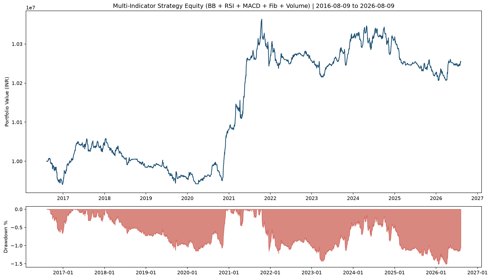

# Multi-Indicator Backtest Report

**Generated:** 2026-08-09 07:49:20

## Strategy (no change to existing golden-cross code — standalone run)

Base trend: **Golden Cross / Death Cross (50/200)**  
Confirmation filters added for this report:

| Indicator | Role |
|-----------|------|
| **Bollinger Bands (20, 2σ)** | Enter near mid/lower band strength; exit on mid-band break |
| **RSI (14)** | Enter only if RSI 40–65; exit if RSI > 75 |
| **MACD (12, 26, 9)** | Enter when MACD > signal; exit on bearish MACD cross |
| **Fibonacci (60-day swing)** | Prefer entries near 38.2% / 50% / 61.8% support |
| **Volume** | Require volume ≥ 20-day average |

Risk exits: **−8% stop loss**, **+40% take profit**, plus death cross.

## Period & Capital

- **Backtest Period:** 2016-08-09 to 2026-08-09 (10 years)
- **Universe:** Nifty 500 (429 stocks with data)
- **Initial Capital:** ₹10,000,000
- **Ending Capital:** ₹10,254,478
- **Net P&L:** ₹254,414 (2.54%)

## Performance Summary (includes Calmar & Sortino)

| Metric                |   Value |
|:----------------------|--------:|
| Total Return (%)      |    2.54 |
| CAGR (%)              |    0.25 |
| Max Drawdown (%)      |    1.52 |
| Sharpe Ratio          |  -12.61 |
| Sortino Ratio         |  -14.76 |
| Calmar Ratio          |    0.17 |
| Annual Volatility (%) |    0.53 |
| Win Rate (%)          |   40.22 |
| Number of Trades      | 4694    |
| Avg Trade Return (%)  |    0.22 |
| Avg Win (%)           |    5.79 |
| Avg Loss (%)          |   -3.53 |
| Profit Factor         |    1.1  |
| Expectancy (%)        |    0.22 |
| Best Trade (%)        |   36.51 |
| Worst Trade (%)       |   -8.26 |
| Avg Holding (days)    |    8.6  |
| Recovery Factor       |    1.68 |
| Ulcer Index           |    0.79 |

## Simple P&L

| | Amount |
|---|--------|
| Start | ₹10,000,063 |
| End | ₹10,254,478 |
| Profit / Loss | ₹254,414 |
| CAGR | 0.25% |
| Max Drawdown | 1.52% |
| **Sortino** | **-14.76** |
| **Calmar** | **0.17** |
| Profit Factor | 1.10 |

## Exit Reasons

| exit_reason     |   count |   avg_return_pct |
|:----------------|--------:|-----------------:|
| bb_mid_break    |    1590 |            -3.08 |
| death_cross     |     103 |            -0.24 |
| macd_bear_cross |    1040 |            -1.54 |
| rsi_overbought  |    1727 |             6.16 |
| stop_loss       |     234 |            -8.00 |

## Charts

## Files

- `multi_indicator_equity_20260809_074920.png` — equity + drawdown
- `multi_indicator_trades_20260809_074920.csv` — all trades with indicator entry tags
- `multi_indicator_report_20260809_074920.md` — this report

## How to read Calmar & Sortino

- **Sortino**: return vs *downside* volatility only (higher = better risk-adjusted return)
- **Calmar**: CAGR ÷ Max Drawdown (higher = more return per unit of worst drawdown)

## Disclaimer

Educational backtest only. Past performance does not guarantee future results. Not financial advice.
